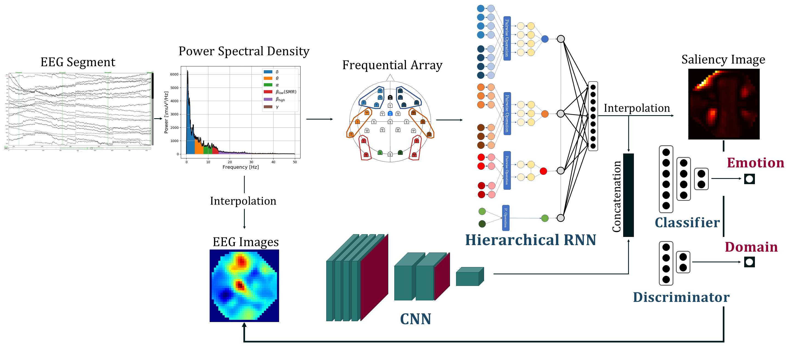

# Emotion-EEG

Set of models for emotion estimation from EEG. Composed by the combination of two deep-learing models learning together (RNN and CNN) with the help of a saliency analysis. 

## Instruction

The three proposed models are direcly available here:

* Saliency based combination of the hierarchical RNN and CNN. [Sal_Model.py](Sal_Model.py)
* Feature fusion of the hierarchical RNN and CNN. [Feat_Model.py](Feat_Model.py
)[Sal_Model](Sal_Model.py)* Ouput fusion of the hierarchical RNN and CNN. [Loss_Model.py](Loss_Model.py)

## Installation and Dependencies

[Pytorch 1.5](https://pytorch.org/get-started/locally)  

[MNE](https://mne.tools/stable/install/mne_python.html#install-python-and-mne-python)

[Cuda 10.1](https://developer.nvidia.com/cuda-toolkit)

## Remarks

Due to the EULA for each dataset, some example signals have been proposed to test the models, however, **they are not corresponding to signals from one of tested dataset**.

If you are interested in our work, don't hesitate to contact us. 

Best! :smile: 